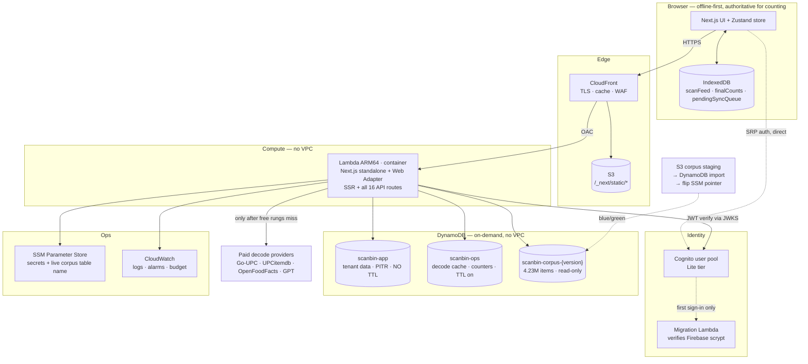

# AWS target architecture — design only

**Status: DESIGN. Nothing implemented, nothing deployed, no code changed. Firebase, Vercel and Turso remain untouched and in production.**

Written 2026-08-19. Research performed live the same day (AWS pricing/docs, Terraform, Cognito); every price below is dated and sourced, and anything unverified is marked. Designed against *this* application as it actually is, verified from the code — not against a generic Next.js app.

---

## 0. The three facts that decided this design

Everything below follows from three things I verified in the code, not from AWS preference.

**1. The `/tmp` corpus architecture is already dead in production.**
`.vercelignore` excludes `knowledge.generated.db` and `.db.gz`. The revert commit `decc1ace` removed the `.gz` from git. So `getKnowledgeDb()` returns `null` on Vercel and *every* corpus lookup already falls through to Turso over HTTP. The elaborate `/tmp` decompress + 7-day staleness guard + generation-fingerprint machinery in `knowledgeDb.ts` is a **local-development code path**.

> We are not migrating a `/tmp` cache. We are replacing **one remote key-value lookup**. That is a far smaller problem than the current code's shape suggests.

**2. Every corpus query is an equality lookup on a single key.**

```sql
SELECT ... FROM retail WHERE barcode = ?
SELECT ... FROM retail WHERE barcode IN (?,?,?,?,?)   -- the 5 zero-padded variants
SELECT * FROM tires  WHERE barcode = ?
SELECT * FROM tires  WHERE canonical_product_uid = ?
SELECT canonical_product_uid FROM tire_part_numbers WHERE normalized_part_number = ?
SELECT * FROM tires  WHERE UPPER(REPLACE(size,' ','')) = ?
```

No ranges. No aggregation. One trivial lookup join. **A relational database is not required by a single query in the corpus layer.**

**3. The application is optimistic-local-first by law.**
The TOP-LEVEL LAW requires `ensureProvisionalCount` to run synchronously *before any network call*. Every scan is counted, rendered and persisted locally before a server is contacted; sync drains asynchronously from a client-side queue with idempotency keys.

> **Server latency is not on the user's critical path.** This is what makes scale-to-zero compute (with its cold starts) an acceptable engineering trade here, where it would be unacceptable for a typical CRUD app. It also means an 8 ms difference in corpus lookup latency is invisible to a user, so the corpus decision should optimize for *operability*, not microseconds.

---

## 1. Recommended architecture

**A VPC-less, scale-to-zero, three-service architecture.**

| Concern | Choice |
|---|---|
| Hosting + API | **One container image** (Next.js 16 `standalone` + AWS Lambda Web Adapter) on **Lambda ARM64**, exposed by a **Function URL** |
| CDN / TLS / domain | **CloudFront** + **S3** (static assets) + **Route 53** |
| All data | **DynamoDB** — 3 tables, on-demand |
| Auth | **Cognito user pool** (Lite tier) + user-migration Lambda |
| Secrets | **SSM Parameter Store** SecureString (free tier) |
| Object storage | **S3** — assets, corpus staging, exports, TF state |
| Logs/metrics | **CloudWatch** (14-day retention, IA class for verbose groups) |
| Queues | **None at v1** (see §7) |
| IaC | **Terraform 1.15.x**, AWS provider v6.x, S3 backend with native locking |

**The single most important property: there is no VPC anywhere in this design.** No subnets, no NAT gateway, no security groups, no RDS Proxy, no VPC endpoints. Lambda, DynamoDB, S3, Cognito, CloudFront, SSM and CloudWatch are all public-API services. This one decision removes ~$32/month of NAT gateway, several hundred lines of Terraform, and an entire class of "why can't my Lambda reach the database" failures.

Choosing Postgres would have forced all of it back.

### Why not the "standard" answers

| Rejected | Reason (researched 2026-08-19) |
|---|---|
| **AWS Amplify Hosting** | Officially supports Next.js **up to 15**. Next 16 is not on the supported list, and Amplify explicitly does not support streaming or on-demand ISR. Non-starter for a Next 16 app. |
| **AWS App Runner** | **Closed to new customers since 2026-04-30.** AWS points new users to ECS Express Mode. Eliminated. |
| **OpenNext / SST** | The most capable self-hosted Next path, but `@opennextjs/aws` v4.1.0's **Next.js 16 support is unverified** and its release notes show selective 16.x exclusions. The standardized adapter built on Next's new Build Adapters API is targeted **end of 2026**. Adopting it now means betting the deploy on a moving target — and this app uses **none** of what OpenNext exists to solve (verified: no `middleware.ts`, no `runtime = "edge"`, no ISR, no `revalidate`, no cron). |
| **Aurora / RDS Postgres** | Forces a VPC. Cheapest always-on realistic cost: RDS `db.t4g.micro` single-AZ ≈ **$14/mo** + NAT ≈ $32/mo; Aurora Serverless v2's non-paused floor ≈ **$48/mo**. Buys relational power that zero queries in this app need. |
| **Aurora DSQL** | GA since 2025-05-27, genuinely good ($8/M DPU, free tier). But still a VPC-less *SQL* answer to a problem that has no SQL in it, with real compatibility gaps. Reconsider only if the product later grows genuine reporting/analytics needs. |
| **API Gateway** | $1.00/M requests for HTTP API. With one Lambda behind CloudFront, a **Function URL costs $0** and does the same job. Add API Gateway only when multi-function routing or request authorizers are actually needed. |

### Why Lambda Web Adapter beats the alternatives *here*

- **Version-agnostic.** LWA proxies HTTP to `next start`. It does not parse Next's build output, so Next 16 (and 17) carry no adapter risk. AWS's repo lists Next.js as an officially supported example, including a response-streaming variant.
- **One artifact.** A single Docker image is the entire deployable. No codegen step, no split server/image/revalidation functions.
- **Portable escape hatch.** *The same image runs unchanged on Lambda, ECS Fargate, EC2 and a laptop.* If cold starts ever prove unacceptable, the fix is a Terraform target change, not a rewrite. That is real insurance for a decision made under uncertainty.
- **Scale to zero.** Idle cost ≈ $0, which matters enormously at 1–5 shops.

---

## 2. Architecture diagram



**Read the diagram for what is *absent*:** no VPC, no load balancer, no NAT gateway, no connection pooler, no queue, no cache tier, no second compute service.

---

## 3. Migration map

| Today | AWS | Notes |
|---|---|---|
| Firebase Auth | **Cognito user pool (Lite)** | Custom login page is kept — we call the Cognito SDK exactly where we call Firebase's today. No Managed Login needed, which is why Lite (not Essentials) is right. |
| `verifyIdToken()` × 13 routes | **`aws-jwt-verify`** against Cognito JWKS | Same shape: bearer token in, claims out. |
| Firestore (tenant data) | **DynamoDB `scanbin-app`** | Single-table. See §4. |
| Firestore security rules (634 lines) | **Server-side authorization in the API layer** | The biggest change in the whole migration. See §5 and §12. |
| Firestore `_appliedKeys` transaction | **DynamoDB conditional write** | `ConditionExpression: attribute_not_exists(pk)` — a native primitive, arguably stronger than the current transaction. |
| Turso `tires` + `retail` | **DynamoDB `scanbin-corpus`** | See §6. |
| Turso `decode_cache`, `learned_products`, `share_tokens` | **DynamoDB `scanbin-ops`** (TTL) | |
| Turso `ladder_kv`, `goupc_usage` counters | **DynamoDB `UpdateItem` + `ADD` + condition** | `incrementIfBelow(key, limit)` maps 1:1 to `ADD #v :one` with `ConditionExpression: attribute_not_exists(#v) OR #v < :limit`. Money path — see §12. |
| Turso `decode_archive`, `decode_outcomes` | **DynamoDB `scanbin-ops`** with TTL | Append-only; TTL replaces manual purge. |
| better-sqlite3 local corpus | **Unchanged — stays for local dev** | Behind a `CorpusRepository` seam: SQLite locally, DynamoDB in cloud. |
| Vercel hosting | **CloudFront + S3 + Lambda** | |
| Vercel serverless functions | **One Lambda** (all 16 routes) | |
| Vercel env vars | **SSM Parameter Store** SecureString | Free tier. |
| Vercel build/deploy | **GitHub Actions → ECR → Lambda** | OIDC, no long-lived keys. |
| `vercel.json` `ignoreCommand` | **GitHub Actions path filter** | |
| `@vercel/speed-insights` | **CloudWatch RUM** *or drop it* | Recommend dropping at first; it is not load-bearing and already has a kill switch. |
| Firebase emulator (local) | **DynamoDB Local** (Docker) | Preserves the offline test story. |
| Firestore rules tests (11 suites) | **Authorization unit tests** against the API layer | Coverage must be re-proven, not assumed. |

---

## 4. Database design

Three tables, each justified by a **different lifecycle** — not by data type. That is the whole rationale for not using one table.

### `scanbin-app` — tenant data
On-demand · **PITR enabled** · **no TTL attribute on the table at all**

> **Why no TTL here:** TTL is table-wide and keyed to one attribute name. If tenant inventory shared a table with TTL-bearing cache items, a single bug that stamped that attribute onto a `ScanEvent` would silently delete counted stock. Under a product whose top law is "every scan counts," that risk is not worth one fewer table.

| Entity | PK | SK |
|---|---|---|
| Business | `BIZ#<businessId>` | `META` |
| Member | `BIZ#<businessId>` | `MEMBER#<userId>` |
| Product | `BIZ#<businessId>` | `PRODUCT#<productId>` |
| Alias | `BIZ#<businessId>` | `ALIAS#<cleanCode>` |
| Session | `BIZ#<businessId>` | `SESSION#<sessionId>` |
| Inventory count | `BIZ#<businessId>` | `COUNT#<sessionId>#<productId>` |
| Scan event | `BIZ#<businessId>#SESSION#<sessionId>` | `EVENT#<createdAt>#<eventId>` |
| Review item | `BIZ#<businessId>` | `REVIEW#<reviewId>` |
| Audit event | `BIZ#<businessId>` | `AUDIT#<createdAt>#<id>` |
| Applied key | `IDEMPOTENCY#<idempotencyKey>` | `APPLIED` |
| User profile | `USER#<userId>` | `PROFILE` |
| Membership index | `USER#<userId>` | `MEMBEROF#<businessId>` |
| Catalog entry | `CATALOG#<normalizedBarcode>` | `ENTRY` |
| Shop override | `BIZ#<businessId>` | `OVERRIDE#<normalizedBarcode>` |

**Access patterns — all satisfied by PK/SK, no GSI needed:**
- `loadBusinessData(businessId)` → one Query on `BIZ#<id>`, returns products + aliases + sessions + counts in a single paginated call. *This is strictly better than today's four parallel Firestore `getDocs` calls.*
- Scan events for a session → Query `BIZ#<id>#SESSION#<sid>`, naturally ordered by the `createdAt` prefix in the SK. Replaces the `scanEvents(sessionId, createdAt)` composite index.
- `listMemberships()` → Query `USER#<uid>` with `begins_with(SK, "MEMBEROF#")`.
- Catalog lookup by barcode → GetItem on `CATALOG#<barcode>`.
- Idempotency → conditional PutItem on `IDEMPOTENCY#<key>`.

**Two GSIs, replacing exactly the two remaining Firestore composite indexes:**

| GSI | PK | SK | Serves |
|---|---|---|---|
| `GSI1` | `verificationStatus` | `firstSeenAt` | catalog-review pending queue |
| `GSI2` | `verificationStatus#provenanceTier` | `updatedAt` | ladder-verified review queue |

### `scanbin-ops` — global operational state
On-demand · **TTL on `expiresAt`** · no PITR needed (all rebuildable)

| Item | PK | TTL |
|---|---|---|
| Decode cache | `DECODE#<code>` | yes |
| Learned product | `LEARNED#<code>` | no |
| Go-UPC miss cache | `MISS#<canonical>` | yes |
| Ladder counter | `KV#<key>` | no |
| Monthly usage | `USAGE#<YYYY-MM>` | no |
| Share token | `SHARE#<token>` | yes |
| Decode archive | `ARCHIVE#<code>` / `SK=<ts>` | yes |
| Decode outcome | `OUTCOME#<code>` / `SK=<ts>` | yes |

### `scanbin-corpus-<version>` — read-only reference
On-demand · created **only** by S3 import · never written at runtime

| Item | PK | SK |
|---|---|---|
| Retail barcode | `R#<barcode>` | `-` |
| Tire barcode | `T#<barcode>` | `-` |
| Tire part number | `P#<normalizedPartNumber>` | `-` (→ uid) |
| Tire identity | `U#<canonicalProductUid>` | `-` |
| Tire size index | `S#<normalizedSize>` | `<canonicalProductUid>` (one-to-many) |

~4.23M items: 4,047,273 retail + 79,108 tire barcodes + 28,017 part numbers + 72,956 identities.

The `IN (5 variants)` retail query becomes a single `BatchGetItem` of ≤5 keys — one round trip, same as today.

---

## 5. Authentication design

**Cognito user pool, Lite tier**, email/password + Google federation, with the **existing custom login page kept**. We swap `firebase/auth` calls for Cognito SDK calls inside `src/lib/auth.ts` — the one file that is already the auth adapter, now with `AuthService`/`AuthUser` ports declared over it. Components do not change: they consume `AuthUser`, which is provider-neutral.

**Password migration — the critical mechanic.** Cognito shipped native password-hash import on 2026-07-15 supporting BCRYPT / SCRYPT / ARGON2ID / PBKDF2_SHA256. **Firebase's hashes cannot use it.** Firebase uses a modified scrypt requiring a project-level *signer key*, *salt separator*, *rounds* and *mem_cost* — parameters with nowhere to live in Cognito's `N$r$p$salt$hash` format.

The correct path is the **user-migration Lambda trigger**:

1. Import all users via CSV (profile only, no passwords).
2. On a user's first sign-in, Cognito invokes the migration Lambda.
3. The Lambda verifies the submitted password against the exported Firebase hash using a `firebase-scrypt` implementation, with the project's signer key held in SSM.
4. On success it returns the profile; Cognito finalizes the account with the now-known password.

**Nobody is forced to reset a password, and nobody notices the migration.** After a cutover window, delete the hash store and remove the trigger.

**Google federation needs explicit care.** Cognito treats a federated identity as a *distinct* user. Same-email account linking must be configured deliberately (`AdminLinkProviderForUser`) or Google users will silently get empty new workspaces. This is the highest-risk detail in the auth phase and gets its own test.

**Roles stay in the app database.** Today `businessMembers.role` is the authority and `roleAccess.ts` is pure. Do **not** move roles into Cognito groups: it would split the authorization model across two systems for no gain. Cognito answers "who is this?"; DynamoDB answers "what may they do?" — exactly the current split.

---

## 6. Barcode corpus strategy

**DynamoDB, loaded by S3 import, addressed through an SSM pointer.**

### The rebuild pipeline (blue/green, free rollback)

```
build:knowledge-db  →  export to DynamoDB-JSON in S3
                    →  aws dynamodb import-table  (creates scanbin-corpus-2026-08-19)
                    →  smoke-test N known barcodes against the NEW table
                    →  flip SSM /scanbin/corpus/table-name
                    →  keep the previous table 30 days, then delete
```

DynamoDB's S3 import **can only create a new table** — normally a limitation, here it is exactly right. It gives an immutable, versioned corpus, a verify-before-flip gate, and a rollback that is *one SSM parameter change* with no data movement. That is strictly better than today's model, where a bad `build-tire-knowledge` run could overwrite a 79k-barcode index in place (the F1 defect that had to be guarded against).

GSIs are populated free at import time. Import cost is **$0.15/GB** of uncompressed source — roughly **$0.10–0.15 per full rebuild**.

### Why not the alternatives

| Option | Verdict |
|---|---|
| **Bake SQLite into the container image** (359 MB, under the 10 GB limit) | Genuinely tempting: $0 marginal cost, microsecond lookups, and it reuses the *already-written and locally-tested* `getKnowledgeDb()` path. Rejected because it couples corpus updates to application deploys, bloats every cold start with a 359 MB lazily-streamed layer, and makes the corpus opaque to inspection. It buys ~8 ms on a path the user never waits for, and costs operability. **Reconsider only if DynamoDB lookup latency ever shows up in decode budgets.** |
| **S3 sharded JSON** (prefix-sharded objects) | Near-zero cost, but 20–50 ms plus parse per lookup, and it reinvents cache management. Strictly worse than DynamoDB for more work. |
| **S3 Express One Zone** | Built for high-throughput object workloads, ~4–5× S3 Standard per GB. Wrong tool for keyed lookups. |
| **Keep Turso** | Works, but leaves a third vendor in place for something DynamoDB does for ~$0.15/month inside the account we already need. |

**Cost: ~$0.15/month storage** (~0.6 GB) **plus reads measured in cents.** The corpus stops being an architectural problem and becomes a line item.

---

## 7. API / backend strategy

**Start with one Lambda for everything.** All 16 API routes plus SSR live in the same container. Lambda scales per request, so a slow decode never blocks a page render — there is no head-of-line blocking to design around.

**Split `/api/ai-lookup` into its own function when — and only when — one of these is true:**
- decode p99 duration forces a web-route timeout longer than ~10 s, or
- decode memory needs diverge from SSR needs, or
- you want blast-radius isolation for the paid-spend path.

Until then, a second function is complexity without benefit.

**Five new endpoints are required** — and only five, because the client-direct Firestore surface is exactly that small. Verified: every client-side Firestore call funnels through `appDeps` in `scanStore.ts` plus `listMemberships` in `auth.ts`.

| New endpoint | Replaces | Plugs into |
|---|---|---|
| `POST /api/sync/apply` | `FirebaseSyncTarget.apply` | `SyncTarget` |
| `GET /api/business/bootstrap` | `loadBusinessData` | `DatabaseService.loadBusinessData` |
| `POST /api/audit` | `auditRepository.append` | `DatabaseService.audit` |
| `GET /api/catalog/lookup` | `catalogRepository.getByBarcode` | `DatabaseService.lookupGlobalCatalog` |
| `GET /api/sessions/:id/events` | `getScanEventsBySession` | `ScanSessionRepository` |

**These are exactly the members of the `DatabaseService` port extracted last session.** The migration's client-side work is implementing one new `SyncTarget` + `DatabaseService` against HTTP. The store, the ledger, the queue, the idempotency keys and the offline behavior are untouched.

**Queues: none at v1.** The pending-sync queue is client-side and must stay that way — it is what makes the app work offline. Nothing else is asynchronous. Add EventBridge Scheduler → Lambda only if the weekly harvest or corpus rebuild moves into AWS. SQS's 1M free requests/month will be there if a genuine need appears; inventing one now would be architecture theater.

**Config change required:** add `output: "standalone"` to `next.config.ts` (currently unset). Keep `serverExternalPackages` — a container handles the native modules cleanly.

---

## 8. Frontend hosting strategy

CloudFront in front of two origins:
- `/_next/static/*`, `/public/*` → **S3** (immutable, long max-age, never touches Lambda)
- everything else → **Lambda Function URL** via Origin Access Control

Route 53 for DNS, ACM for TLS. Deploy = build image → push to ECR → update Lambda → sync static to S3 → targeted CloudFront invalidation.

**Two CloudFront pricing models exist as of Nov 2025; pick deliberately.** Classic pay-as-you-go includes an always-free 1 TB egress + 10 M requests/month, which covers small and medium usage outright. The newer flat-rate plans (Free $0 / **Pro $15** / Business $200) bundle WAF, DDoS protection, Route 53, TLS and CloudWatch ingestion with **no overage charges**. Start on pay-as-you-go; move to Pro when predictability is worth more than the delta.

---

## 9. Terraform structure

Terraform **1.15.x**, AWS provider **v6.x**. Folder-per-environment, not workspaces — workspaces share code and make a prod mistake one typo away.

```
infra/
  modules/
    network/        # DNS + ACM only. There is deliberately no VPC module.
    data/           # 3 DynamoDB tables, TTL, PITR, GSIs
    compute/        # ECR repo, Lambda (container), Function URL, IAM
    edge/           # CloudFront, S3 static bucket, OAC
    auth/           # Cognito pool, client, migration Lambda
    observability/  # log groups w/ retention, alarms, budget
  envs/
    dev/    main.tf  backend.tf  dev.tfvars
    prod/   main.tf  backend.tf  prod.tfvars
```

**S3 backend with native locking — no DynamoDB lock table.** Native S3 state locking went GA in Terraform 1.11:

```hcl
terraform {
  backend "s3" {
    bucket       = "scanbin-tfstate"
    key          = "prod/terraform.tfstate"
    region       = "us-east-1"
    encrypt      = true
    use_lockfile = true   # GA in TF 1.11 — replaces the DynamoDB lock table
  }
}
```

**Secrets never enter Terraform.** Parameters are *created empty* by Terraform and populated out-of-band via `aws ssm put-parameter`; Lambda reads them at cold start. Terraform state still records resource attributes in plaintext, so the state bucket is encrypted, versioned and IAM-restricted regardless.

**Tooling, sized for a solo developer:** `tflint` + `terraform-docs` + **Trivy** (tfsec's successor — tfsec was archived into it). **No Terragrunt** — it adds a second mental model for a project with two environments. **No HCP Terraform** — its unlimited free tier ended 2026-03-31 and now caps at 500 managed resources; plain S3 state plus GitHub Actions with OIDC is simpler and free.

**Claude Code manageability** (an explicit priority): every component here is inspectable and mutable from the CLI — `aws dynamodb get-item`, `aws lambda update-function-code`, `aws ssm get-parameter`, `terraform plan`. Nothing hides behind a console-only workflow. This is a genuine argument *against* the baked-SQLite corpus option, whose contents would be opaque.

---

## 10. Estimated monthly cost

Prices researched 2026-08-19. **DynamoDB on-demand: $0.125/M read units, $0.625/M write units, $0.25/GB-mo** (reflecting the Nov 2024 50% cut — many blogs still quote the old $1.25). **Lambda: $0.20/M requests + ~$0.0000133/GB-s on ARM.** **Cognito Lite: 10,000 MAU free.**

Assumptions stated so they can be argued with:

| | Small | Medium | Large |
|---|---|---|---|
| Shops / users | 3 / 10 | 25 / 100 | 200 / 800 |
| Scans per month | 10,000 | 250,000 | 2,500,000 |
| Decodes per month | 2,000 | 30,000 | 250,000 |
| CDN egress | 5 GB | 50 GB | 400 GB |

| Service | Small | Medium | Large |
|---|---|---|---|
| DynamoDB writes | $0.05 | $1.25 | $12.50 |
| DynamoDB reads | $0.02 | $0.15 | $1.10 |
| DynamoDB storage | $0.30 | $0.70 | $5.20 |
| Lambda | $0.20 | $3.50 | $45.00 |
| CloudFront | $0 *(free tier)* | $0 *(free tier)* | $10.00 |
| Cognito | $0 | $0 | $0 |
| S3 | $0.50 | $1.00 | $3.00 |
| CloudWatch | $1.00 | $5.00 | $20.00 |
| Route 53 | $1.00 | $1.00 | $1.00 |
| SSM Parameter Store | $0 | $0 | $0 |
| **Total** | **≈ $3** | **≈ $13** | **≈ $98** |

Excludes paid AI decode spend, which is an application cost and unchanged by this migration.

**Cognito is $0 at every modeled scale** — 800 MAU against a 10,000 MAU free allowance. **CloudFront is free through medium** on the always-free 1 TB / 10 M requests.

Two honest caveats: CloudWatch is the line most likely to overrun (its default retention is *never expire* — set retention explicitly on day one), and the Large row assumes decode Lambda duration dominates, which is sensitive to how long paid providers take.

---

## 11. Migration order

Six phases, each independently reversible, ordered by *risk ascending*.

| # | Phase | Risk | Reversal |
|---|---|---|---|
| 0 | AWS account, Terraform skeleton, GitHub OIDC, S3 state, budget alarm | none | Delete the stack; no app change |
| 1 | **Corpus → DynamoDB** | **very low** — read-only | Env flag back to Turso |
| 2 | Ops state → DynamoDB (cache, learned, counters, tokens) | low–medium | `LadderStorage` selector back to Turso |
| 3 | Hosting → Lambda + CloudFront (still on Firebase) | medium | DNS back to Vercel |
| 4 | **Tenant data → DynamoDB** | **high** | Dual-write window; flag back to Firestore |
| 5 | Auth → Cognito | high | Both pools live during the window |
| 6 | Decommission Turso, Vercel, Firebase | — | — |

Phases 1–3 touch no user data and no identity. Phase 4 is the real migration and should not start until 1–3 are boring.

---

## 12. Risks

| # | Risk | Severity | Mitigation |
|---|---|---|---|
| R1 | **634 lines of Firestore rules become server code.** Today the browser talks to Firestore directly and *rules* enforce tenancy. On DynamoDB the client cannot reach the database, so every rule becomes API-layer authorization — including the 11 emulator-backed rules suites, whose coverage must be rebuilt, not assumed. | **Critical** | Port each rules suite to an API authorization test *before* cutover. Treat "rules tests still pass" as meaningless — they will not run at all. |
| R2 | **Google federation identity linking.** Cognito treats a federated user as distinct; unlinked Google users silently get empty new workspaces. | High | `AdminLinkProviderForUser` by verified email, with an explicit test asserting an existing workspace is joined, not created. |
| R3 | **DynamoDB modelling is hard to undo.** A wrong key schema means a full table rebuild. | High | Model against the *verified* access-pattern list in §4 and prove each one before Phase 4. |
| R4 | **The money path.** `incrementIfBelow` is the atomic daily-cap charge (PR #35). A wrong DynamoDB condition either double-charges or blocks a paying customer. | High | Port the existing concurrency test verbatim: 100 concurrent charges against a cap of 40 must grant exactly 40. Do not ship on a passing unit test alone. |
| R5 | **Cold starts.** A container Lambda cold start is ~1–3 s. | Medium | Mitigated by design — scans never wait on the server. If it still hurts: same image → Fargate, no rewrite. |
| R6 | **CloudWatch cost creep.** Default retention is never-expire. | Medium | Explicit 14-day retention on every log group in Terraform; IA class for verbose groups. |
| R7 | **`account/export` response size.** Lambda buffers at 6 MB. | Medium | Stream (200 MB limit) or write to S3 and return a presigned URL. |
| R8 | **Two source-of-truth windows** during Phases 4–5. | Medium | Time-boxed dual-write with a reconciliation job that diffs both stores and fails loudly. |
| R9 | **OpenNext/Amplify may become the better path** once the official Next adapter ships (~end 2026). | Low | LWA is deliberately reversible; revisit after the adapter GAs. |
| R10 | **Corpus import is create-only**, so rebuild automation must manage table lifecycle. | Low | Scripted in Phase 1; the SSM pointer *is* the abstraction. |

---

## 13. Rollback strategy

**Every phase keeps both systems running and switches with configuration, not code.**

- **Phases 1–2** — a single environment variable or SSM parameter selects Turso or DynamoDB. The `LadderStorage` and `CorpusRepository` seams already exist for exactly this. Rollback is seconds.
- **Phase 3** — Vercel stays deployed and warm. Rollback is a DNS change.
- **Phase 4** — dual-write to Firestore *and* DynamoDB for the full window; reads flip by flag. Rollback flips reads back with no data loss, because Firestore never stopped receiving writes.
- **Phase 5** — both identity providers live simultaneously. Rollback re-points the login page at Firebase; the migration Lambda has not destroyed anything.
- **Corpus** — rollback is one SSM parameter pointing at the previous table, which is retained 30 days.
- **Terraform** — every environment is a separate state file; `terraform destroy` on `dev` cannot touch `prod`.

**Nothing is deleted until a phase has been stable in production for an agreed period.** Decommissioning is Phase 6, deliberately last and separate.

---

## 14. What to migrate first

### **The barcode corpus (Turso `tires` + `retail`) → DynamoDB.**

**It is the only component with all four properties:**

1. **Read-only.** No write path, so no data-loss risk of any kind.
2. **Already isolated behind one seam.** Last session's cleanup collapsed five duplicated Turso client factories into `src/server/db/tursoClient.ts`, and corpus access already sits behind `getKnowledgeDb()` / the knowledge-index modules. A `CorpusRepository` port with `SqliteCorpus` (local) and `DynamoCorpus` (cloud) implementations drops straight in — the same technique already proven by `LadderStorage`.
3. **Reversible in seconds** — an environment variable, with Turso still running.
4. **It proves the entire toolchain end-to-end at zero user risk**: AWS account, Terraform, CI with OIDC, DynamoDB modelling, the import pipeline, the SSM pointer, cost tracking, and CloudWatch — all exercised on a component that cannot corrupt a customer's inventory.

It also **retires a paid vendor immediately** and deletes the most platform-coupled code in the repository (`knowledgeDb.ts`'s `/tmp` decompression, staleness guard and generation fingerprint — machinery that, as established in §0, does not even run in production today).

**Concretely, first task:** dual-read. Query both Turso and DynamoDB for every corpus lookup, return Turso's answer, and log any disagreement. Run it over the 2,000-code certification corpus. When disagreements are zero, flip the flag. When it has been boring for a week, delete the Turso path.

**Do not start with auth or hosting.** Auth is the highest-risk phase and should be last among the functional migrations. Hosting looks easy and is genuinely medium-risk, but it delivers no vendor reduction on its own — it only moves where the same code runs.

---

## Appendix — what I could not verify

Stated so nobody treats these as settled:

- `@opennextjs/aws` v4.1.0's *exact* Next.js 16 support (release notes show selective 16.x exclusions).
- Whether Cognito's July 2026 SCRYPT importer definitively rejects Firebase's variant — inferred by comparing the two documented hash formats, not from an AWS/Firebase compatibility statement. **The migration-Lambda approach in §5 is correct either way**, which is why the design does not depend on resolving it.
- DynamoDB's per-partition throughput ceiling and published p50/p99 latency (not on current official pages).
- Import duration for ~4M items (cost is documented; wall-clock is not).
- RDS `t4g.micro` hourly rate and CloudFront legacy per-request pricing (secondary sources; AWS's pages are JS-rendered).
